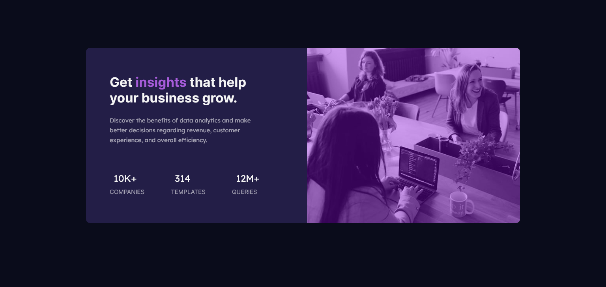

# Frontend Mentor - Stats preview card component solution

This is a solution to the [Stats preview card component challenge on Frontend Mentor](https://www.frontendmentor.io/challenges/stats-preview-card-component-8JqbgoU62). Frontend Mentor challenges help you improve your coding skills by building realistic projects. 

## Table of contents

- [Overview](#overview)
  - [The challenge](#the-challenge)
  - [Screenshot](#screenshot)
  - [Links](#links)
- [My process](#my-process)
  - [Built with](#built-with)
  - [What I learned](#what-i-learned)
  - [Continued development](#continued-development)
  - [Useful resources](#useful-resources)
- [Author](#author)
- [Acknowledgments](#acknowledgments)

**Note: Delete this note and update the table of contents based on what sections you keep.**

## Overview

### The challenge

Users should be able to:

- View the optimal layout depending on their device's screen size

### Screenshot
For Desktop view


For Mobile view

### Links

- Solution URL: (https://github.com/Dnnacheta/web3bridge-assignment)
- Live Site URL: (https://dnnacheta.github.io/web3bridge-assignment/)

### Built with

- Semantic HTML5 markup
- CSS custom properties
- Flexbox
<!-- - [React](https://reactjs.org/) - JS library
- [Next.js](https://nextjs.org/) - React framework
- [Styled Components](https://styled-components.com/) - For styles -->

### What I learned

Here the few skills I picked-up doing this challenge:

1.  I learnt how to overlay a translucent color over an image in css.

```css
  .img-container {
    position:relative;
  }
  
  .img-container:before {
    content:"";
    position: absolute;
    top:0;
    left:0;
    height:100%;
    width:100%;
    background-color: rgba(137, 6, 224, 0.38);
    z-index:999;
    border-top-right-radius: 10px;
    border-bottom-right-radius: 10px;
  }
}
```
```
```
### Continued development

Still new to the mobile first concept and I will continue to improve on this skill to perfect it.

**Note: My plans for continued development.**

### Useful resources

- Almighty Stackoverflow! (https://stackoverflow.com/questions) - Sorry could keep tracke of the many articles I perused through. 
- (https://chiamakaikeanyi.dev/sizing-in-css-px-vs-em-vs-rem/) - This article helped me get a good grasp of REM and EM CSS units. I'd recommend it to anyone still learning this concept.
- (https://dev.to/ali6nx404/confused-about-rem-and-em-units-in-css-26go) - This cool and easy to follow article by Mahesh Patidar from dev.to relly helped.

## Author

- Website - [David Nnacheta](stay tuned!)
- Frontend Mentor - [@Dnnacheta](https://www.frontendmentor.io/profile/Dnnacheta)
- Twitter - [@Dnnacheta](https://www.twitter.com/dnnacheta)

## Acknowledgments

Thanks to the awesome guys at Web3bridge for the opportunity to learn in their community.